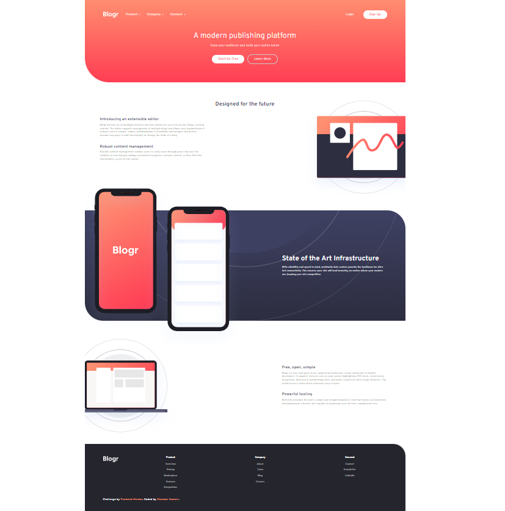

# Frontend Mentor - Blogr landing page solution

This is a solution to the [Blogr landing page challenge on Frontend Mentor](https://www.frontendmentor.io/challenges/blogr-landing-page-EX2RLAApP). Frontend Mentor challenges help you improve your coding skills by building realistic projects.

## Table of contents

- [Frontend Mentor - Blogr landing page solution](#frontend-mentor---blogr-landing-page-solution)
  - [Table of contents](#table-of-contents)
  - [Overview](#overview)
    - [The challenge](#the-challenge)
    - [Screenshot](#screenshot)
    - [Links](#links)
    - [Built with](#built-with)
  - [Author](#author)

## Overview

### The challenge

Users should be able to:

- View the optimal layout for the site depending on their device's screen size
- See hover states for all interactive elements on the page

### Screenshot

**Mobile View :**

---

**Desktop View :**

### Links

- Solution URL: [Add solution URL here](https://github.com/chandan9369/Responsive-Bloger-Website-using-html-css-js)
- Live Site URL: [Add live site URL here](https://bloger-website-by-chandan-keshari.netlify.app/)

### Built with

- Semantic HTML5 markup
- CSS custom properties
- Flexbox
- CSS Grid
- Mobile-first workflow
- Js

## Author

- Website - [Chandan Keshari](https://www.frontendmentor.io/profile/chandan9369)
- Frontend Mentor - [@chandan9369](https://www.frontendmentor.io/profile/chandan9369)
